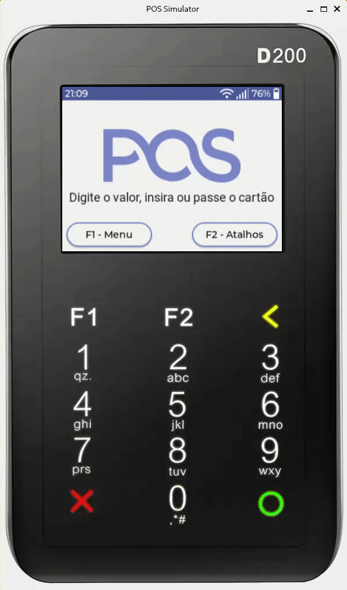

# POS Simulator

Simple Point of Sale simulator made in Qt (PIN-Pad interface is not included).

# Demostration



# Dependencies

- [Qt 6](https://www.qt.io/product/qt6)
- [LVGL](https://lvgl.io/) (built-in)

# Build

In this folder execute:

```sh
mkdir build
cmake -B./build .
cmake --build build
```

The executable can be found in `build/application/application.exe`

# Frequent issues

## Qt libraries not found in the configuration phase

The make could not find the Qt installation path, to solve this problem you have to create an environment variable Qt6_DIR with this path.

On Windows it's usualy in `C:\Qt\6.4.0\gcc_64`.

On Mac or Linux you can add `export Qt6_DIR="/opt/Qt/6.4.0/gcc_64"` in your `~/.bashrc` or `~/.zshrc`.

##  Qt libraries not found in execution phase

Qt core libraries aren't in the system PATH.

On Windows it is usualy in `C:\Qt\6.4.0\gcc_64\bin`.

On Mac or Linux you can add `export PATH=$Qt6_DIR/bin:$PATH` in your `~/.bashrc` or `~/.zshrc`
